# DARTSim Visualization Documentation

This document explains the visualizations created for the DARTSim simulation environment. These plots provide insights into the team's trajectory, formation dynamics, altitude management, and mission execution.

## Overview

DARTSim (Distributed Autonomous Real-Time Simulation) models a team of drones executing a mission. The visualizations capture:
- **Scenarios**: The environmental layout with threats, targets, and route patterns
- **Environmental Uncertainty**: The stochastic nature of the environment and sensor variability
- **Trajectory**: The path taken by the team through the environment
- **Formation**: How the team arranges itself (LOOSE vs TIGHT formation)
- **Altitude**: Vertical positioning strategy (altitude levels 1-4)
- **ECM Status**: Electronic Countermeasures activation
- **Threats & Targets**: Sensor readings of threats and targets ahead

---

## 0. Scenario Visualizations

### Scenario Comparison

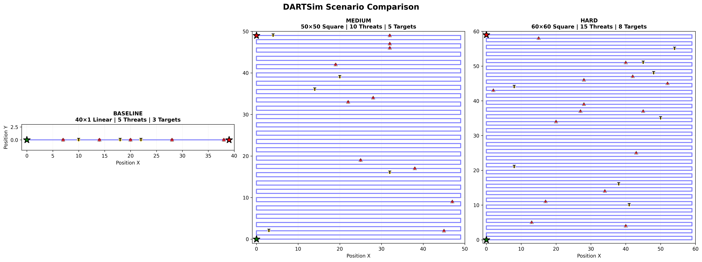

**Description**: A side-by-side comparison of all three DARTSim scenarios, showing the differences in map layout, route complexity, and threat/target density.

**Key Features**:
- **Three Scenarios**: Baseline (easy), Medium, and Hard
- **Map Types**: Linear vs Square (snake pattern)
- **Threat Density**: Visual representation of threat distribution
- **Target Distribution**: Shows where targets are located
- **Route Pattern**: Blue line shows the path the team must follow

**Insights**: This comparison helps understand the increasing difficulty across scenarios:
- **Baseline**: Simple linear route with moderate threats
- **Medium**: Complex square map with more threats and targets
- **Hard**: Largest map with highest threat/target density

---

### Baseline Scenario

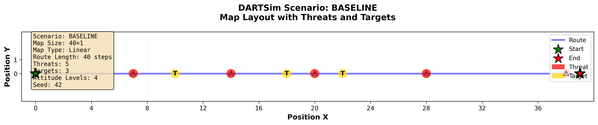

**Description**: The baseline (easy) scenario used for initial training and baseline comparisons.

**Key Features**:
- **Map Size**: 40×1 (linear map)
- **Map Type**: Linear route (straight line from start to end)
- **Threats**: 5 threats distributed along the route
- **Targets**: 3 targets to detect
- **Altitude Levels**: 4 levels available
- **Route**: Simple straight-line path

**Characteristics**:
- Predictable threat and target distribution
- Moderate difficulty suitable for learning
- Straightforward navigation (no turns)
- Good for baseline performance comparisons

**Use Cases**:
- Initial agent training
- Baseline performance metrics
- Algorithm development and debugging
- Understanding basic mission mechanics

---

### Medium Scenario

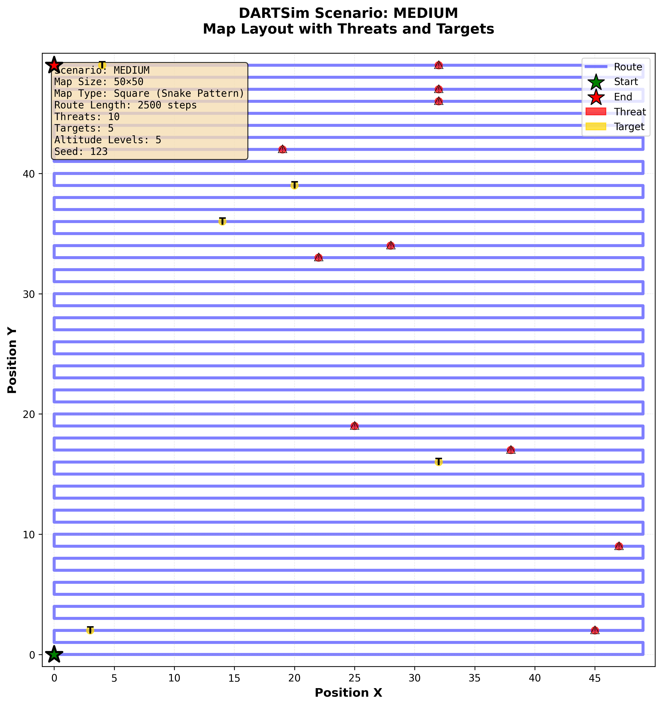

**Description**: A medium-difficulty scenario with increased complexity and more challenges.

**Key Features**:
- **Map Size**: 50×50 (square map)
- **Map Type**: Square map with snake pattern route (zigzag)
- **Threats**: 10 threats distributed across the map
- **Targets**: 5 targets to detect
- **Altitude Levels**: 5 levels available
- **Route**: Complex snake pattern with multiple turns

**Characteristics**:
- More threats and targets than baseline
- Square map adds uncertainty (sensor readings change with direction)
- Snake pattern route requires navigation through turns
- Higher altitude levels provide more tactical options

**Use Cases**:
- Testing adaptation capability
- Stress testing algorithms
- Evaluating performance under increased complexity
- Testing robustness to route changes

---

### Hard Scenario

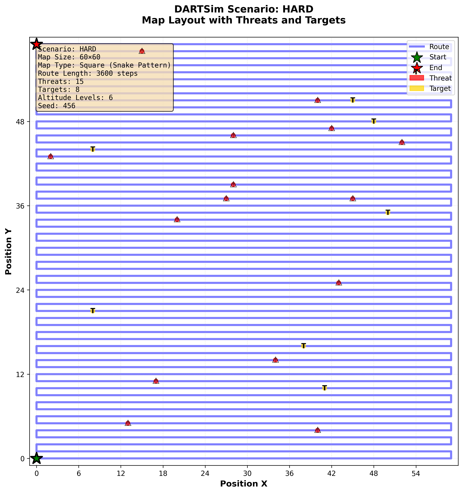

**Description**: The hardest scenario, designed to test generalization and performance under extreme conditions.

**Key Features**:
- **Map Size**: 60×60 (largest square map)
- **Map Type**: Square map with snake pattern route
- **Threats**: 15 threats (highest density)
- **Targets**: 8 targets to detect
- **Altitude Levels**: 6 levels available
- **Route**: Longest route with most turns

**Characteristics**:
- Highest threat and target density
- Largest map requiring longest mission duration
- Most complex navigation challenges
- Maximum altitude options for tactical flexibility
- Tests generalization from easier scenarios

**Use Cases**:
- Generalization testing
- Final performance evaluation
- Testing algorithm limits
- Real-world scenario simulation

---

### Scenario Parameters Summary

| Scenario | Map Size | Map Type | Threats | Targets | Altitude Levels | Seed | Difficulty |
|----------|----------|----------|---------|---------|-----------------|------|------------|
| **Baseline** | 40×1 | Linear | 5 | 3 | 4 | 42 | Easy |
| **Medium** | 50×50 | Square | 10 | 5 | 5 | 123 | Medium |
| **Hard** | 60×60 | Square | 15 | 8 | 6 | 456 | Hard |

**Visualization Elements**:
- **Green Star (★)**: Mission start position
- **Red Star (★)**: Mission end position
- **Blue Line**: Route the team must follow
- **Red Circles with ⚠**: Threat positions (dangerous areas)
- **Gold Circles with T**: Target positions (objectives to detect)
- **Grid Lines**: Map coordinate system

**Route Patterns**:
- **Linear Maps**: Straight line from (0,0) to (map_size, 0)
- **Square Maps**: Snake pattern that zigzags through the grid:
  - Even rows: left to right
  - Odd rows: right to left
  - Creates a continuous path covering the entire map

**Note on Threat/Target Positions**: The actual positions of threats and targets in DARTSim are randomly generated based on the seed. The visualizations show representative distributions that match the scenario parameters. Actual positions may vary slightly between runs, but the density and distribution patterns remain consistent.

---

## 1. Environmental Uncertainty Visualizations

DARTSim exhibits environmental uncertainty where the same state-action pair can lead to different outcomes. This stochasticity is primarily due to sensor noise and environmental variability. Understanding this uncertainty is crucial for interpreting agent behavior and performance.

### Uncertainty Overview

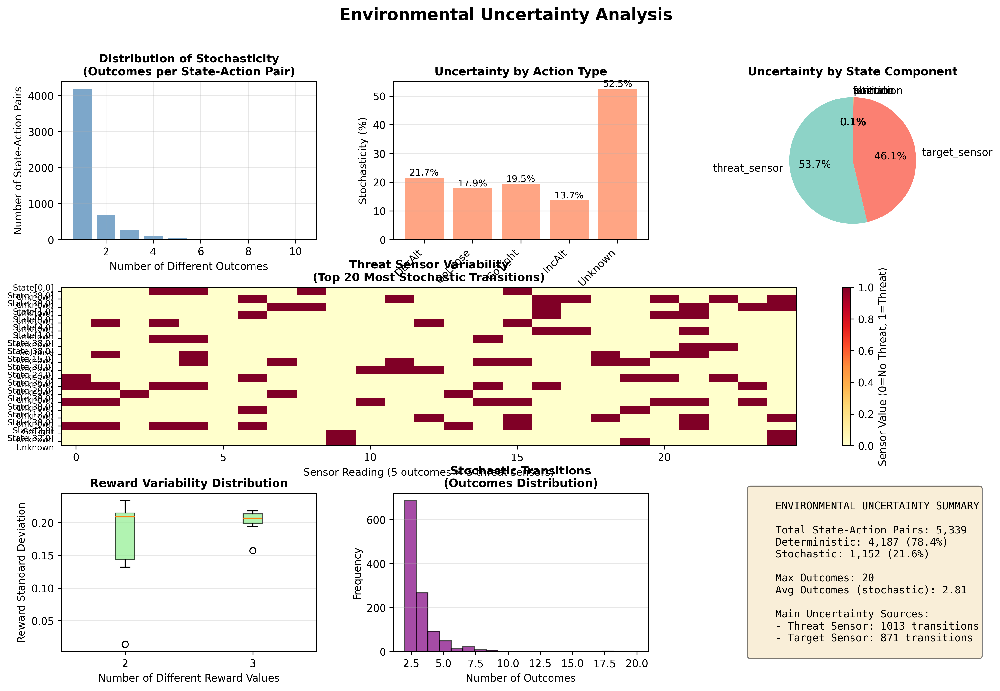

**Description**: A comprehensive dashboard analyzing the stochastic nature of the DARTSim environment, showing how uncertainty manifests across different aspects of the system.

**Key Components**:

1. **Distribution of Stochasticity** (Top Left):
   - Bar chart showing how many different outcomes each state-action pair can produce
   - Most state-action pairs are deterministic (1 outcome)
   - Some pairs have multiple possible outcomes (stochastic transitions)
   - Helps identify the overall level of environmental uncertainty

2. **Uncertainty by Action Type** (Top Center):
   - Shows which actions are most affected by uncertainty
   - Percentage of stochastic transitions for each action type
   - Actions like altitude changes or ECM activation may have different uncertainty levels
   - Helps understand which actions are most unpredictable

3. **Uncertainty by State Component** (Top Right):
   - Pie chart showing which state components vary most in stochastic transitions
   - Components include: position, altitude, formation, ECM, direction, threat_sensor, target_sensor
   - Sensor readings (threat_sensor, target_sensor) are typically the main sources of uncertainty
   - Reveals what aspects of the state are most affected by environmental stochasticity

4. **Threat Sensor Variability** (Middle, Full Width):
   - Heatmap showing the top 20 most stochastic state-action pairs
   - Each row represents a state-action pair
   - Columns show threat sensor readings (5 cells ahead) for different outcomes
   - Color intensity indicates threat detection (red = threat detected, yellow = no threat)
   - Demonstrates how sensor readings can vary for the same state-action pair

5. **Reward Variability Distribution** (Bottom Left):
   - Box plot showing the distribution of reward standard deviations
   - Groups by number of different reward values per state-action pair
   - Shows how much reward can vary for stochastic transitions
   - Important for understanding the impact of uncertainty on learning

6. **Stochastic Transitions Distribution** (Bottom Center):
   - Histogram showing the frequency of different outcome counts
   - Focuses only on stochastic transitions (2+ outcomes)
   - Shows how many different outcomes are typically possible
   - Helps quantify the complexity of the uncertainty

7. **Summary Statistics** (Bottom Right):
   - Key metrics about environmental uncertainty:
     - Total vs. deterministic vs. stochastic state-action pairs
     - Maximum number of outcomes observed
     - Average outcomes for stochastic transitions
     - Main uncertainty sources (threat sensor, target sensor)

**Insights**:
- **Stochasticity Level**: Shows what percentage of transitions are deterministic vs. stochastic
- **Uncertainty Sources**: Identifies that sensor readings are the primary source of uncertainty
- **Action Impact**: Reveals which actions are most affected by environmental uncertainty
- **Learning Challenge**: High uncertainty makes it harder for agents to learn optimal policies

---

### Sensor Uncertainty Examples

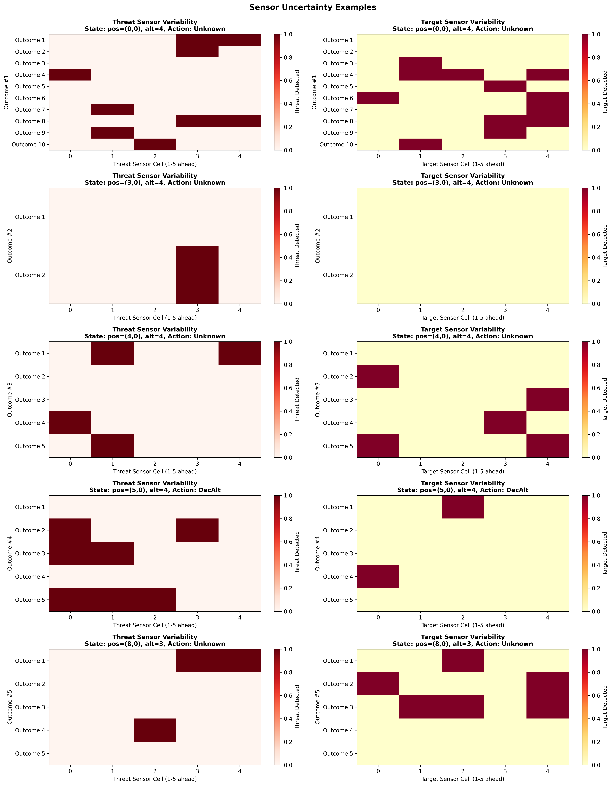

**Description**: Detailed examples showing how sensor readings can vary for the same state-action pair, demonstrating the stochastic nature of threat and target detection.

**Key Features**:

- **Multiple Examples**: Shows 5 different state-action pairs that exhibit sensor uncertainty
- **Threat Sensor Variability** (Left Column):
  - Heatmap for each example showing threat sensor readings across different outcomes
  - Rows = different possible outcomes from the same state-action pair
  - Columns = 5 threat sensor cells (looking 1-5 steps ahead)
  - Red = threat detected, white/yellow = no threat
  - Shows how the same action can lead to different threat detections

- **Target Sensor Variability** (Right Column):
  - Similar heatmap for target sensor readings
  - Shows variability in target detection
  - Demonstrates that target detection is also stochastic

- **State Information**: Each example shows:
  - Position coordinates (x, y)
  - Altitude level
  - Action taken
  - Multiple possible outcomes with different sensor readings

**Insights**:
- **Sensor Noise**: Demonstrates that sensors are not perfectly reliable
- **Outcome Diversity**: Shows that the same state-action can produce many different sensor readings
- **Decision Complexity**: Explains why agents must handle uncertainty in their decision-making
- **Real-World Relevance**: Reflects realistic sensor limitations in real-world scenarios

**Why This Matters**:
- Agents must learn robust policies that work across different possible outcomes
- High uncertainty makes exploration and exploitation more challenging
- Understanding uncertainty helps explain why certain actions might be preferred
- Stochasticity is a key challenge that RS-DRL and other algorithms must address

---

### Understanding Environmental Uncertainty

**Sources of Uncertainty**:

1. **Sensor Noise**:
   - Threat sensors have false positive and false negative rates
   - Target sensors also exhibit detection uncertainty
   - Same position can yield different sensor readings

2. **Environmental Variability**:
   - Threat and target positions may not be perfectly known
   - Environmental conditions can affect sensor performance
   - Multiple valid interpretations of the same situation

3. **Action Outcomes**:
   - Some actions may have probabilistic effects
   - Environmental responses can vary
   - System evolution is not fully deterministic

**Impact on Learning**:

- **Exploration**: Agents must explore despite uncertainty
- **Exploitation**: Must learn robust policies that handle variability
- **Generalization**: Policies must work across different possible outcomes
- **Performance**: Uncertainty can lead to suboptimal decisions if not properly handled

**Relationship to Other Visualizations**:

- **Scenarios**: Show the static layout; uncertainty shows the dynamic variability
- **Trajectories**: Show actual paths taken; uncertainty explains why paths may differ
- **Formations**: Show tactical decisions; uncertainty explains why decisions might vary
- **Altitude Timeline**: Shows altitude changes; uncertainty explains variability in altitude strategy

---

## 2. Trajectory Visualizations

### 2D Trajectory Plot

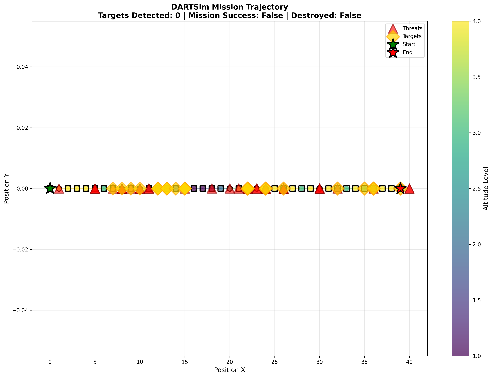

**Description**: This plot shows the team's path projected onto the 2D ground plane (X-Y coordinates). 

**Key Features**:
- **Path Color**: Color-coded by altitude level (using viridis colormap)
  - Darker colors = Lower altitude
  - Brighter colors = Higher altitude
- **Formation Markers**: 
  - Squares (□) = LOOSE formation (spread out)
  - Circles (○) = TIGHT formation (close together)
- **ECM Status**: Red edge color indicates ECM (Electronic Countermeasures) is active
- **Start/End Markers**: Green star (★) marks mission start, red star marks end
- **Path Lines**: Gray lines connect consecutive positions, showing the trajectory

**Insights**: This visualization helps understand the horizontal navigation strategy and how altitude changes correlate with position.

---

### 3D Trajectory Plot

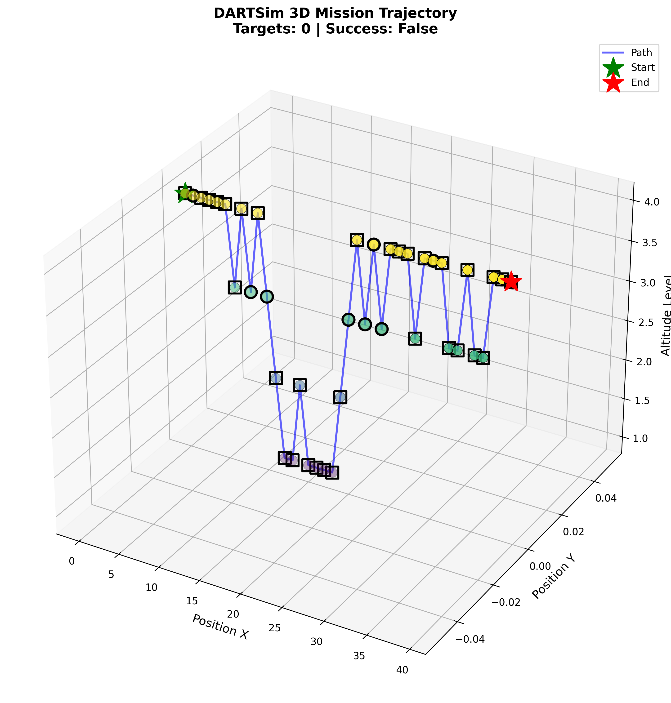

**Description**: A three-dimensional view of the team's complete trajectory, showing both horizontal movement (X, Y) and vertical positioning (altitude).

**Key Features**:
- **3D Path**: The trajectory is shown as a continuous 3D curve
- **Altitude Dimension**: The Z-axis represents altitude levels (1-4)
- **Color Coding**: Similar to 2D plot, colors indicate altitude
- **Formation Visualization**: Individual drone positions shown in formation at each step
- **Interactive Elements**: (If using interactive version) Hover to see step details

**Insights**: This provides a complete spatial understanding of the mission path, showing how the team navigates both horizontally and vertically to avoid threats and reach targets.

---

## 3. Formation Visualizations

### Formation Visualization

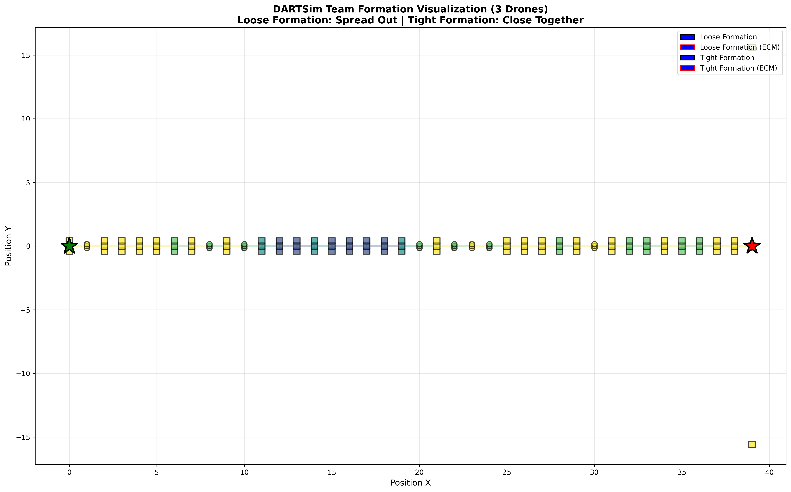

**Description**: Shows the team formation throughout the entire mission, with individual drone positions represented.

**Key Features**:
- **Individual Drones**: Each drone in the team (typically 3 drones) is shown as a separate marker
- **Formation Types**:
  - **LOOSE Formation**: Drones spread out (larger spacing, square markers)
  - **TIGHT Formation**: Drones close together (smaller spacing, circular markers)
- **Altitude Encoding**: Drone color indicates altitude level (viridis colormap)
- **ECM Indicator**: Red edge color on drones when ECM is active
- **Path Context**: Gray lines show the trajectory path

**Insights**: This visualization demonstrates how the team adapts its formation in response to threats. TIGHT formation is typically used when threats are detected, while LOOSE formation is used for normal navigation.

---

### Formation Evolution

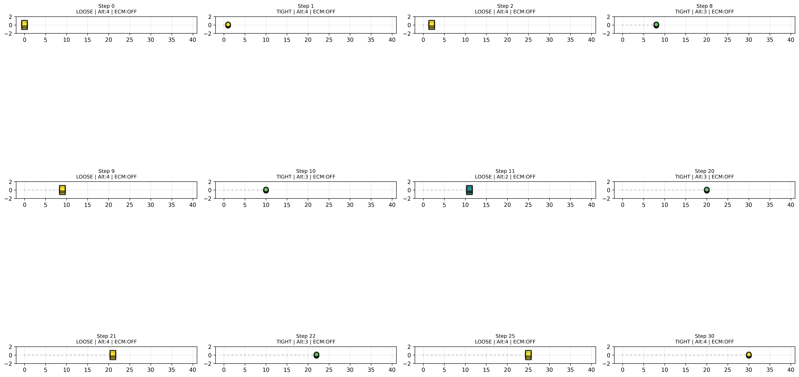

**Description**: A snapshot-style visualization showing how the formation changes at key moments during the mission.

**Key Features**:
- **Multiple Snapshots**: Shows up to 12 key moments in the mission
- **Key Moments Selected**:
  - Formation changes (LOOSE ↔ TIGHT)
  - ECM activation/deactivation
  - Mission start and end
  - Every 10th step for context
- **Context Path**: Gray dots show the path taken up to each snapshot
- **Step Information**: Each subplot shows:
  - Step number
  - Current formation type
  - Altitude level
  - ECM status (ON/OFF)

**Insights**: This visualization provides a timeline view of tactical decisions, showing when and why the team changes formation or activates ECM. It helps understand the reactive behavior of the team in response to environmental conditions.

---

## 4. Altitude Timeline

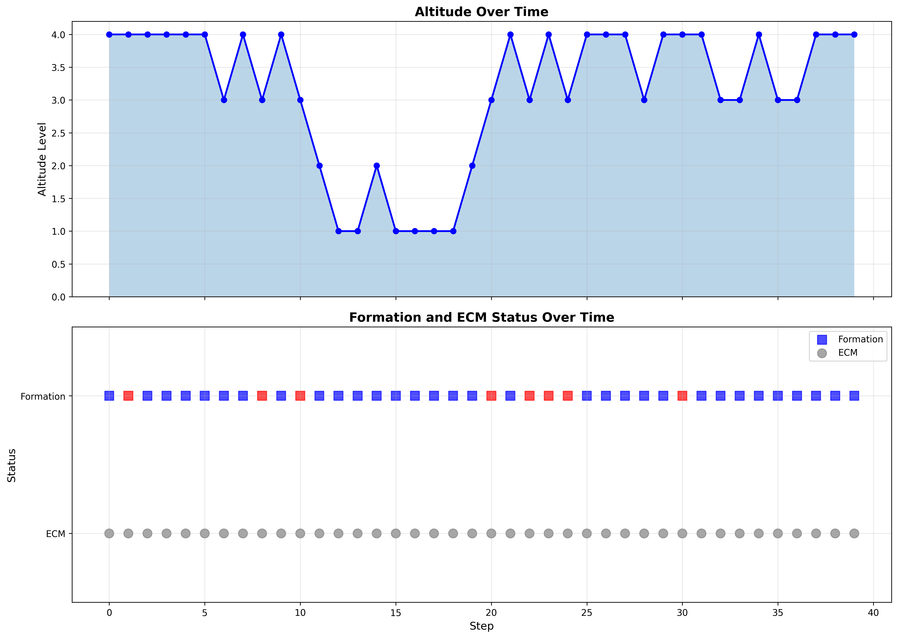

**Description**: A dual-panel plot showing altitude changes over time along with formation and ECM status.

**Key Features**:

**Top Panel - Altitude Over Time**:
- Line plot showing altitude level (1-4) at each step
- Filled area under the curve for visual clarity
- Grid lines for easy reading

**Bottom Panel - Status Indicators**:
- **Formation Status**: 
  - Red squares = TIGHT formation
  - Blue squares = LOOSE formation
- **ECM Status**:
  - Orange circles = ECM ON
  - Gray circles = ECM OFF

**Insights**: 
- **Altitude Strategy**: Shows how the team adjusts altitude to avoid threats or reach targets
- **Correlation Analysis**: Reveals relationships between altitude changes, formation changes, and ECM activation
- **Mission Phases**: Can identify different phases of the mission based on altitude patterns

**Example Patterns**:
- Low altitude (1-2) might indicate threat avoidance
- High altitude (3-4) might indicate target approach or open area navigation
- Rapid altitude changes might indicate evasive maneuvers

---

## Data Structure

The visualizations are generated from trajectory data stored in JSON format. Each step contains:

```json
{
  "position_x": 0,           // Horizontal position X
  "position_y": 0,           // Horizontal position Y
  "direction_x": 1,          // Movement direction X component
  "direction_y": 0,          // Movement direction Y component
  "altitude": 4,             // Altitude level (1-4)
  "formation": "LOOSE",      // Formation type: "LOOSE" or "TIGHT"
  "ecm": false,              // ECM status: true/false
  "threats_ahead": [true, false, false, false, true],  // 5-cell threat sensor
  "targets_ahead": [false, false, false, false, false], // 5-cell target sensor
  "step": 0,                 // Step number
  "action": "GoTight",       // Action taken
  "info": {}                 // Additional information
}
```

---

## Interpretation Guide

### Formation Types

- **LOOSE Formation**: 
  - Used for normal navigation
  - Provides better sensor coverage
  - Less vulnerable to area attacks
  - Indicated by square markers and wider spacing

- **TIGHT Formation**:
  - Used when threats are detected
  - Better for coordinated maneuvers
  - More vulnerable but can move faster
  - Indicated by circular markers and closer spacing

### Altitude Levels

- **Level 1**: Lowest altitude, maximum stealth, limited visibility
- **Level 2**: Low altitude, good for threat avoidance
- **Level 3**: Medium altitude, balanced visibility and stealth
- **Level 4**: Highest altitude, maximum visibility, easier target detection

### ECM (Electronic Countermeasures)

- **Active (Red edge)**: Team is actively countering threats
- **Inactive (Black edge)**: Normal operation, ECM not needed

### Actions

Common actions observed in the trajectory:
- `GoTight`: Switch to tight formation
- `GoLoose`: Switch to loose formation
- `IncAlt`: Increase altitude
- `DecAlt`: Decrease altitude
- `Unknown`: Default/no-op action

---

## Usage

These visualizations can be generated using the visualization scripts:

```bash
# Generate scenario visualizations
python scripts/visualize_scenarios.py --scenario all --output-dir results/test_visualizations

# Generate individual scenario
python scripts/visualize_scenarios.py --scenario baseline --output-dir results/test_visualizations

# Generate uncertainty visualizations
python visualize_uncertainty.py

# Generate formation visualizations
python scripts/visualize_formation.py --trajectory results/test_visualizations/trajectory.json --output results/test_visualizations/formation_visualization.png

# Generate formation evolution
python scripts/visualize_formation.py --trajectory results/test_visualizations/trajectory.json --output results/test_visualizations/formation_evolution.png --evolution

# Generate trajectory and altitude plots
python scripts/visualize_dartsim.py --trajectory results/test_visualizations/trajectory.json
```

---

## Summary

These visualizations provide comprehensive insights into DARTSim mission execution:

1. **Scenario Understanding**: Scenario visualizations show the environmental challenges and static layout
2. **Uncertainty Analysis**: Environmental uncertainty visualizations explain the stochastic nature of the environment and its impact on decision-making
3. **Spatial Understanding**: 2D and 3D trajectory plots show where the team goes during actual execution
4. **Tactical Decisions**: Formation evolution shows when and why tactical changes occur
5. **Altitude Management**: Altitude timeline reveals vertical navigation strategy over time
6. **Team Coordination**: Formation visualizations show how the team works together

**Documentation Flow**:
- **Scenarios** (Section 0): Understand the static environment layout and challenges
- **Uncertainty** (Section 1): Understand the stochastic nature and variability in the environment
- **Trajectories** (Section 2): See how agents navigate through the uncertain environment
- **Formations** (Section 3): Understand tactical team coordination
- **Altitude Timeline** (Section 4): Analyze temporal patterns in decision-making

Together, these plots enable comprehensive analysis of mission performance, tactical decision-making, and the effectiveness of different strategies in the DARTSim environment. The uncertainty visualizations are particularly important for understanding why agents make certain decisions and how environmental stochasticity affects learning and performance.

