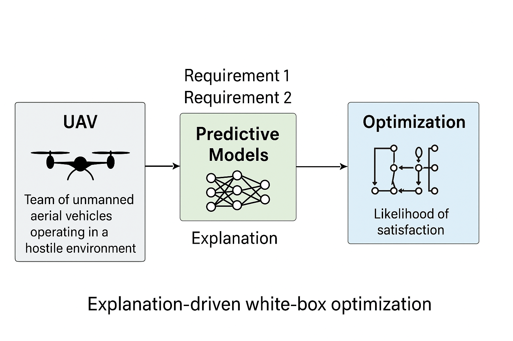

# UAV Case Study in XDA-II: Explanation-Driven Self-Adaptation

## Paper Introduction

**Title:** Efficient Self-Adaptation through Explanation-Driven White-Box Optimization  
**Authors:** Negri, F., Nicolosi, N., Camilli, M. and Mirandola, R.  
**Publication:** ACM Transactions on Autonomous and Adaptive Systems, 2025

This paper introduces **XDA-II**, an explanation-driven, white-box optimization method for runtime self-adaptation in cyber-physical systems (CPS). The central idea is to use interpretable model explanations (PDPs/SPDPs and feature-ranking techniques like SHAP or PFI) computed offline for pre-trained classifiers, then exploit that explanatory information online to steer a fast, effective search for adaptation decisions. The paper evaluates XDA-II on three open-source CPS case studies, each provided in two variants, resulting in 6 study subjects total. This document provides a comprehensive analysis of how the UAV (Team of Unmanned Aerial Vehicles) case study is used in the paper.

### XDA-II Conceptual Diagram: Explanation-Driven White-Box Optimization

The following diagram illustrates the core conceptual model of XDA-II, showing how a UAV system's operational context and requirements are processed through predictive models to generate explanations, which then drive an optimization process to achieve desired satisfaction levels.

**Description of the Diagram:**

This diagram outlines the "Explanation-driven white-box optimization" process, specifically applied to a UAV (Unmanned Aerial Vehicle) team operating in a hostile environment.

1. **UAV System (Left Block):** Represents a "Team of unmanned aerial vehicles operating in a hostile environment." This is the system under adaptation.

2. **Predictive Models (Middle Block):** Takes inputs from the UAV system and external "Requirement 1" and "Requirement 2." It uses a neural network (depicted by interconnected nodes) to process this information and generate an "Explanation." This explanation is crucial for understanding the model's behavior and making the optimization process interpretable.

3. **Optimization (Right Block):** Utilizes the "Explanation" from the predictive models to perform an optimization process (represented by a complex flowchart-like icon). The goal of this optimization is to achieve a high "Likelihood of satisfaction" for the given requirements.

The overall flow demonstrates how XDA-II leverages interpretable models to guide an optimization strategy, making the self-adaptation process more transparent and effective. This white-box approach contrasts with black-box optimizers by providing explanations that inform the adaptation decisions.

---

## Case Studies Overview

The paper evaluates **XDA-II** on **three open-source CPS case studies** (each in two variants, so 6 study subjects total):

1. **ADAS — Advanced Driver Assistance System (ADAS1, ADAS2)**
   - An autonomous vehicle scenario with automated lane-keeping and emergency braking
   - Runtime adaptation addresses safety like lane boundaries and keeping safe distance from pedestrians
   - ADAS1 has 1 controllable feature; ADAS2 has 2 controllable features

2. **RR — Search-and-Rescue Robot (RR1, RR2)**
   - A robotic rover for emergency scenarios (fires, earthquakes, etc.) that must locate people while adapting navigation, sensing, etc.
   - The RR semantic space is larger (9 features) and the two variants use 4 vs. 8 controllable features
   - This RR is also used as the running example in the paper

3. **UAV — Team of Unmanned Aerial Vehicles (UAV1, UAV2)**
   - An autonomous UAV team performing surveying in a hostile environment (balancing target detection vs. threat avoidance)
   - This benchmark has the largest number of requirements (12) and 7 total features
   - The two variants use 3 vs. 6 controllable features

**Additional Notes:**
- The semantics and simulators are taken from prior literature; authors run simulated scenarios to control variables
- Each case study has two variants with half vs. double controllable features to evaluate scalability
- Supporting material and replication package are available

---

## Paper Methodology Overview

### Goal

XDA-II aims to provide faster, cheaper adaptation that preserves or improves effectiveness compared to black-box many-objective optimizers (NSGA-III, FITEST, etc.), which can find good adaptation decisions but are often costly at runtime, especially as the semantic space and requirement count grow.

### Method (Two Stages)

**Offline Pre-processing:**
- Compute global explanations for each predictive model that estimates the probability of satisfying each requirement
- These include PDP/SPDP curves and feature-importance (FI) rankings (SHAP or PFI versions)
- This offline stage runs once before deployment and produces information XDA-II uses at runtime
- Authors measure cost of this stage (PDP/SPDP creation time, FI ranking time and memory)

**Online Planner (White-box Optimizer):**
- Uses precomputed explanations to rank controllable features
- Applies an incremental descent/adjustment procedure that searches neighbouring configurations in an explanation-guided order
- Yields orders-of-magnitude lower online execution time while keeping quality of adaptation high
- The planner enforces requirement probability thresholds and iteratively adjusts least-impactful features first
- Two variants: XDA-II-SHAP and XDA-II-PFI (depending on the FI method used)

### Evaluation Design

**Baselines Compared:**
- Random Search (RS)
- Predecessor XDA
- NSGA-III
- FITEST

**Metrics / Research Questions:**
- **RQ1 (Effectiveness):** Predicted satisfaction likelihood and success rate (actual satisfaction after enacting adaptation)
- **RQ2 (Quality):** Quality score = normalized Euclidean distance between adaptation result and the ideal operating point (lower is better)
- **RQ3 (Online Cost):** Execution time and runtime memory (planner cost)
- **RQ4 (Offline Cost):** Time and memory to compute PDPs/SPDPs and feature rankings

---

## UAV Case Study Overview

### Purpose

The UAV subject represents an autonomous team of unmanned aerial vehicles carrying out a surveying mission in a hostile environment. The team must simultaneously:
- Detect mission targets on the ground using downward-looking sensors
- Avoid threats detected via forward-looking sensors

The distance to threats affects detection likelihood and risk of damage; altitude (distance to ground) affects target detection likelihood but also exposure to threats.

### High-Level Objectives

The managed system must achieve during mission:
1. **Reach/observe mission targets** (maximize detection likelihood)
2. **Avoid or minimize damage from threats** (keep safety requirements satisfied)

These objectives are encoded as requirements. The UAV benchmark has the largest number of requirements — **12**.

### Scenario Summary

- **Mission:** Surveying mission with competing goals: detect ground targets (downward sensors) vs. avoid threats (forward sensors)
- **Trade-off:** Changes in threat proximity, altitude, weather, and target visibility are part of the semantic space the simulator controls
- **Objective:** Satisfy 12 requirements representing detection/safety targets; maximize satisfaction likelihood and real success rate, and minimize distance to ideal operating point
- **Simulation Platform:** The authors run the UAV benchmark in the same simulation platform used for the other subjects; they can control all variables in the semantic space and observe requirement violations under chosen settings

---

## Semantic Space: Features (Total and Controllable)

The semantic space for UAV has **7 features** (a mix of controllable and observable factors). The paper explicitly mentions examples:
- **Controllable features include:** flying speed and team formation
- **Observable features include:** weather conditions and number of threats

**UAV1 and UAV2 differ only in how many of those features are controllable:**

| Variant | Requirements | Total Features | Controllable Features |
|---------|--------------|----------------|----------------------|
| UAV1 | 12 | 7 | 3 |
| UAV2 | 12 | 7 | 6 |

**Why two variants?** The authors intentionally use variants with half vs. double controllable features to evaluate scalability and how adaptation strategies behave as the controllable search space grows.

---

## Experimental Setup

### Simulated Environment

The authors run the UAV benchmark in the same simulation platform used for the other subjects; they can control all variables in the semantic space and observe requirement violations under chosen settings. Supporting material and replication package are available.

### Initial Conditions and Runs

- For each subject (including UAV1 and UAV2) experiments start from **200 different initial assignments** (samples) of semantic variables
- For each initial condition, the planners are allowed an online execution time budget (upper bound) of **1000 seconds** to compute adaptation decisions
- Authors report that some baselines fail to complete within that budget for the hardest subjects
- XDA-II kept median online time well under that budget

### Baselines Used in UAV Experiments

- **RS (Random Search)**
- **Predecessor XDA**
- **NSGA-III**
- **FITEST**

Comparisons are done on the same 200 initial samples and same thresholds.

### XDA-II Variants

Authors run both **XDA-II-SHAP** and **XDA-II-PFI** (difference is how feature importance/ranking is computed offline). Both are evaluated on UAV1 and UAV2.

---

## Metrics Computed for UAV

### Satisfaction Likelihood
- Predicted probability (from the pre-trained classifiers) that an adaptation decision will satisfy each requirement
- Used to guide optimization and reported in RQ1

### Success Rate
- Actual fraction of runs where the enacted adaptation decision satisfied a requirement (actuation + observing the simulated outcome)
- Shown per requirement in Fig.7(e)/(f) for UAV1 and UAV2

### Quality Score
- Normalized Euclidean distance between chosen configuration and the "ideal" operating condition — lower is better
- Distributions shown in Fig.8(e)/(f) for UAV1/UAV2
- Statistical tests in Table 4

### Online Cost
- Wall-clock execution time for the plan component (Fig.9(e)/(f) for UAV1/UAV2)
- Memory usage (Fig.10(e)/(f))
- XDA-II kept median online time low across subjects

### Offline Cost (RQ4)
- PDP/SPDP computation time and FI ranking time (Fig.11 — reported for all subjects including UAV)
- SHAP ranking for NN models can be expensive
- PDP computation for UAV2 took on the order of tens of seconds
- These offline costs are one-time

---

## Detailed Results

### RQ1 — Effectiveness (Success Rate / Satisfaction Likelihood)

**Results:**
- XDA-II-SHAP and XDA-II-PFI achieved success rates comparable to NSGA-III and FITEST on UAV1 and UAV2
- Generally XDA-II matched or was close to black-box baselines on actual success rate per requirement
- The plots with per-requirement success rates are Fig.7(e) (UAV1) and Fig.7(f) (UAV2)

**Interpretation:** XDA-II (both SHAP and PFI variants) achieves similar or better effectiveness (satisfaction likelihood and success rate) than black-box optimizers and significantly outperforms the predecessor XDA as complexity grows.

---

### RQ2 — Quality (Distance to Ideal)

**Results for UAV1:**
- XDA-II variants achieve good (low) quality scores relative to baselines (see Fig.8(e))

**Results for UAV2:**
- The paper explicitly notes FITEST outperforms XDA-II on the quality score metric
- XDA-II remains significantly better than some other baselines such as NSGA-III or XDA in those comparisons
- This is the one case the authors call out where a black-box optimizer achieves better proximity to the ideal
- See the discussion in RQ2 summary and the statistical results in Table 4

**Interpretation:** XDA-II yields good quality decisions (small normalized distance to ideal). One exception noted: for UAV2, FITEST outperformed XDA-II on the quality metric (but XDA-II still beat some other baselines).

---

### RQ3 — Online Cost (Execution Time & Memory)

**Results:**
- XDA-II has a much lower online execution time than NSGA-III and FITEST on both UAV1 and UAV2
- Figures 9(e)/(f) show distributions: while FITEST/NSGA-III exhibit large medians (and some runs exceed allotted budgets), XDA-II medians remain low
- Authors quote medians below 1s across subjects
- Memory usage is also lower for XDA-II (Fig.10(e)/(f))

**Interpretation:** XDA-II shows much lower online execution time and memory than NSGA-III and FITEST across subjects; median online time for XDA-II stays below 1 second across subjects. The authors emphasize fast runtime as a primary benefit.

---

### RQ4 — Offline Cost (PDP/SPDP and FI Ranking)

**Results:**
- For UAV, computing PDPs and SPDPs and feature rankings is non-negligible
- PDP time for UAV2 was on the order of tens of seconds (reported median ~50–80s for UAV2 in the general discussion)
- SHAP ranking for NN models can take much longer (hundreds to thousands of seconds)
- See Fig.11 and RQ4 discussion

**Interpretation:** PDP/SPDP and SHAP/PFI ranking costs vary with subject complexity; these costs are incurred once offline and are justified because they reduce runtime cost. For the largest subjects (UAV2, RR2) PDP computation can take tens of seconds; feature ranking with SHAP for NNs can be expensive. The authors present these trade-offs quantitatively.

---

### Statistical Testing and Effect Sizes

- The authors ran statistical tests on quality and execution-time distributions
- For many comparisons XDA-II vs others are statistically significant with medium/large effect sizes
- For UAV2 vs FITEST the comparison on quality shows FITEST better (and effect sizes/p-values are reported in Table 4)
- See Table 4 and the long table of pairwise tests

---

## Summary of Findings for the UAV Case Study

| Aspect | Observation | Significance |
|--------|-------------|--------------|
| Mission & Scenario | UAV team balances target detection vs threat avoidance | Demonstrates complex trade-offs under uncertainty |
| Semantic Space | 7 features total (3 controllable in UAV1, 6 in UAV2) | Moderate-sized parameter space with scalability test |
| Requirements | 12 requirements (largest among all case studies) | Captures multi-objective dependability |
| Effectiveness | XDA-II matches or nearly matches black-box optimizers | Comparable success rates |
| Quality (UAV1) | XDA-II achieves good quality scores | Effective adaptation |
| Quality (UAV2) | FITEST outperforms XDA-II on quality metric | Trade-off: quality vs. runtime cost |
| Online Cost | XDA-II medians below 1s, much faster than baselines | Orders of magnitude faster |
| Memory Usage | XDA-II uses less memory than baselines | Efficient resource usage |
| Offline Cost | PDP computation ~50-80s for UAV2; SHAP can be expensive | One-time cost justified by runtime benefits |
| Scalability | XDA-II handles doubling of controllable features efficiently | Explanation-guided search scales well |

---

## Authors' Interpretation Specific to the UAV Case

### Scalability / Complexity

UAV has the largest requirement count (12) but a moderate semantic space size (7 features). The variant with more controllable features (UAV2) increases adaptation problem complexity: search space grows, and some black-box optimizers may require significantly more time to find solutions (or may even time out). XDA-II's explanation-guided search keeps runtime cost low even as number of controllable factors doubles.

### Tradeoffs

FITEST can sometimes find configurations that are slightly closer to the ideal (as happened in UAV2) but at the expense of much higher runtime cost; XDA-II finds near-optimal decisions quickly with low runtime overhead. Authors present this as an engineering tradeoff:
- If one needs absolute best proximity to ideal and can accept long planner time, a black-box optimizer might win occasionally
- If runtime responsiveness and predictable, low overhead planning are required, XDA-II is preferable

---

## Overall Interpretation

The UAV team case study demonstrates that:

1. **XDA-II provides comparable effectiveness** to black-box optimizers while being orders of magnitude faster
2. **Explanation-guided search scales well** as the number of controllable features doubles (UAV1 → UAV2)
3. **There is a trade-off between quality and runtime cost** — FITEST can achieve slightly better quality in some cases (UAV2) but at much higher computational cost
4. **XDA-II is suitable for runtime deployment** in real-world autonomous UAV systems where fast, predictable adaptation is required

---

## Key Figures and Tables Referenced

- **Table 2:** Study subject summary, includes UAV1/UAV2 counts
- **Fig.7(e)/(f):** Success rates for UAV1 and UAV2
- **Fig.8(e)/(f):** Quality score distributions for UAV1 and UAV2 (lower is better)
- **Fig.9(e)/(f):** Online execution time per method for UAV1 and UAV2
- **Fig.10(e)/(f):** Memory usage per method for UAV1 and UAV2
- **Fig.11 and RQ4 section:** Offline costs (PDP/SPDP and FI ranking), including UAV
- **Table 4 / statistical test listings:** Pairwise comparisons including UAV subjects

---

## References

- **Main Paper:** Negri, F., Nicolosi, N., Camilli, M. and Mirandola, R. "Efficient Self-Adaptation through Explanation-Driven White-Box Optimization." ACM Transactions on Autonomous and Adaptive Systems, 2025.
- **Replication Package:** Available (authors cite a Zenodo DOI)
- **Simulation Platform:** Same platform used for all case studies (details in replication package)

---

## Validity and Threats

**External Validity:**
- Experiments are run in simulation (single simulator)
- Authors acknowledge external validity threats but mitigate them by:
  - Using multiple, increasingly complex benchmarks that are open source
  - Exhaustively controlling factors in the semantic space
  - Using benchmarks from prior literature

**Internal Validity:**
- Comparisons are done on the same 200 initial samples and same thresholds
- All methods evaluated under identical conditions

